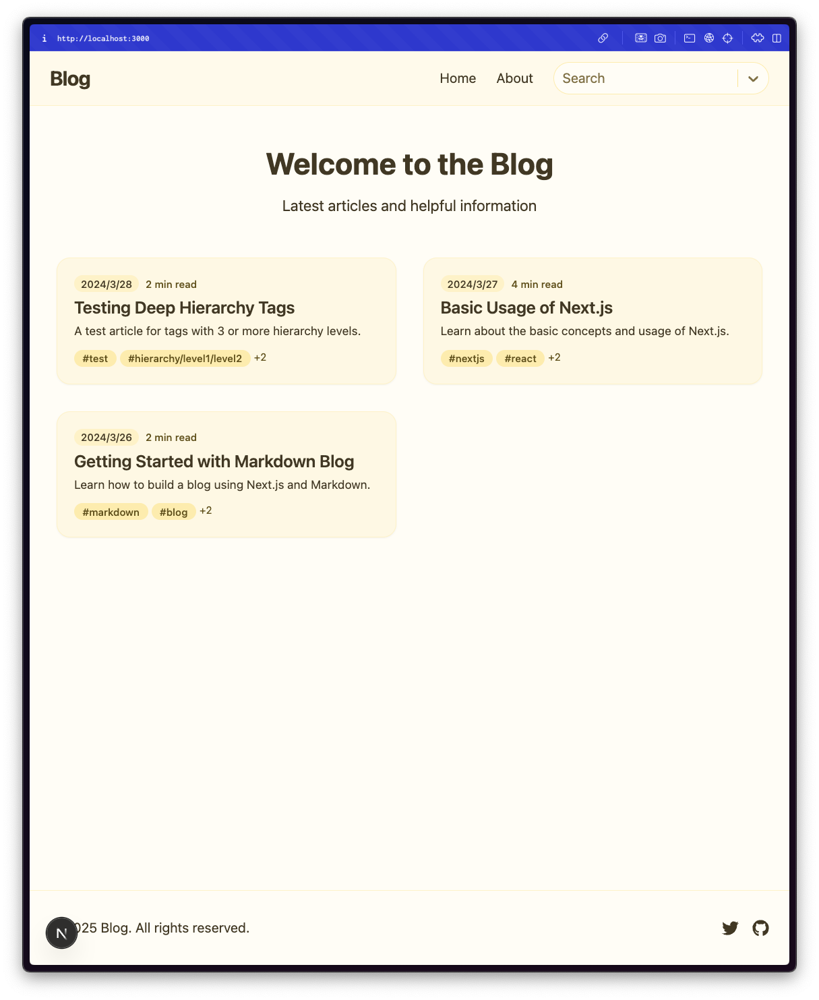
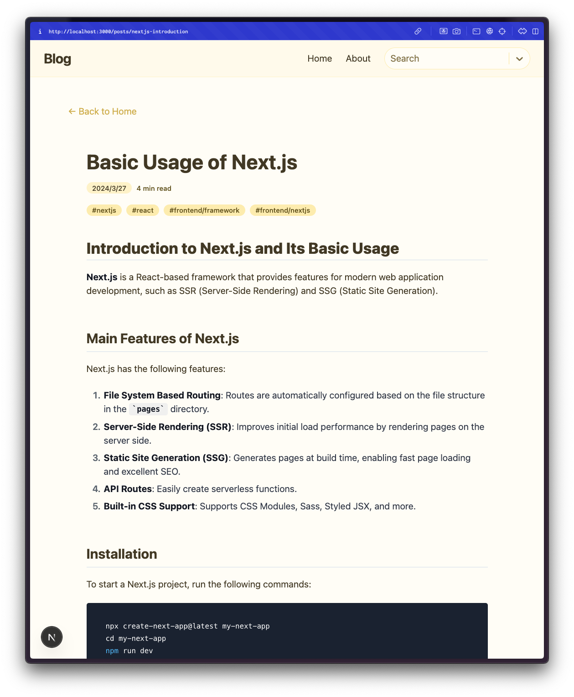
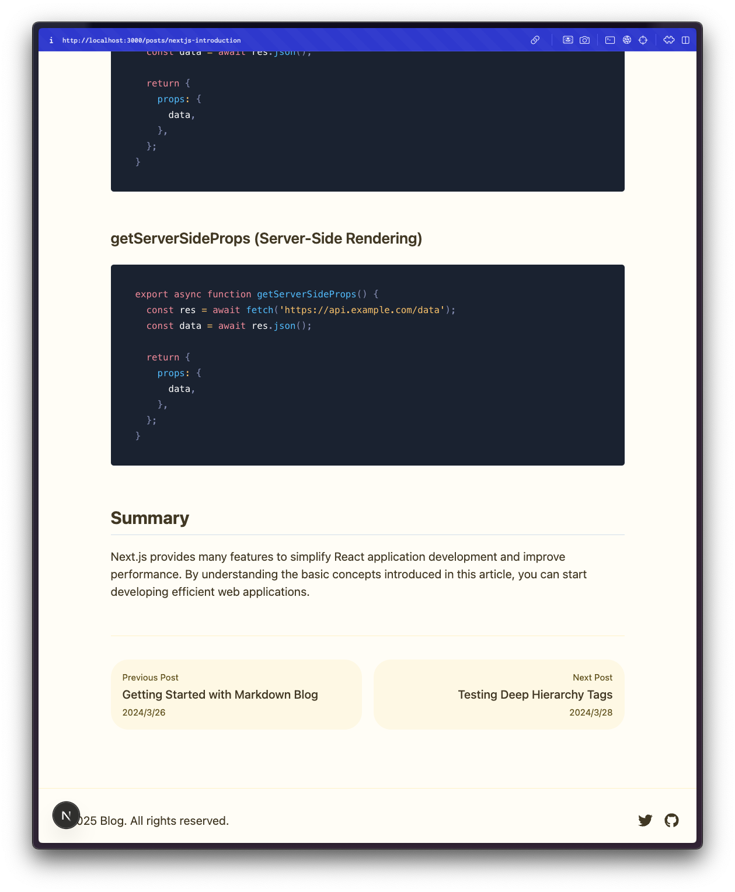
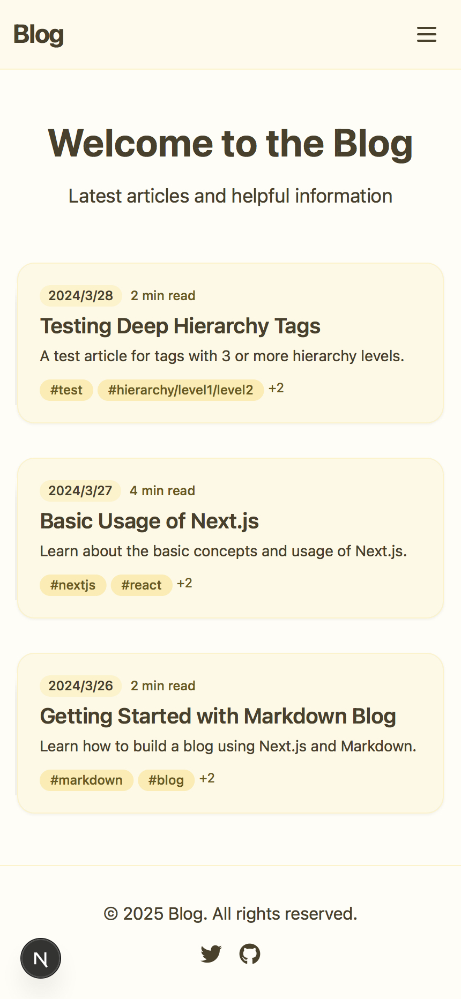
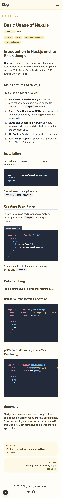

# Blog Template

This is a Blog Template built with Next.js.

> [!CAUTION]
> Some functionalities are provided by a server hosted by Zenn. Commercial use of this server is **NOT** allowed.
>
> If you want to monetize your blog, you **MUST** host the embed server yourself.

## Getting Started

Run the development server:
```bash
npm run dev
```
Then open http://localhost:3000 in your browser.

## Functionality
* Tag-based search
    * Supports nested tags
* Write articles using Markdown
    * Example articles can be found in `src/content/posts`

## Examples

### PC




### Mobile

